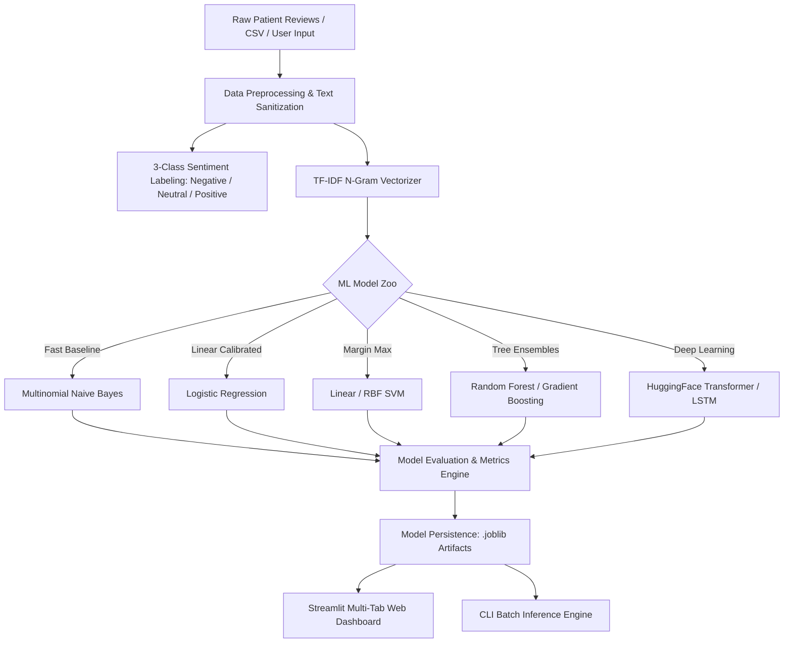

## Sentimental-Analysis-on-Drug-Reviews-using-NLP
Analysis of the drugs name, conditions, reviews and its recommendation for health condition of a patient.

## Problem Statement


Online health-related sites and opinion forums contain ample information about the user's preferences and experiences over multiple drugs and treatment. This information can be leveraged to obtain valuable insights using data mining approaches such as sentiment analysis. Sentiment analysis measures the inclination of people’s opinions through techniques like text analysis and natural language processing. Online user reviews in this domain contain information related to multiple aspects such as the effectiveness of drugs and side effects, which make automatic analysis very interesting but also challenging. However, analyzing the sentiments of drug reviews can provide valuable insights. They might help pharmaceutical companies and doctors to quickly get into bad reviews and know patients' complaints. This sentiment analysis on drug reviews is basically modeled as a classification problem (i.e.,) classifying the sentiment of the user whether positive, negative or neutral based on their choice of words and their reviews. A lot of symptoms and drug sides were hidden under reviews, which will be great to be automatically extracted to improve the drug and help to give a better prescription.

## Question to answer from the data:
- Can you predict the patient's condition based on the review?
- Can you predict the rating of the drug based on the review?
- Can you determine if a review is positive, neutral, or negative?
- What are the key factors of sentiment derived from rating on basis of drug review?

### Data Dictionary:
Name | Description
-----|-------------
`uniqueID`| Unique ID for the review
`drugName`| Name of the prescribed/reviewed drug
`condition`| Medical condition being treated
`review`| Patient narrative / review text
`rating`| 10-point patient satisfaction rating (1.0 to 10.0)
`date`| Date of review entry
`usefulCount`| Number of community users who found the review helpful

---

## System Architecture



### 3-Class Sentiment Mapping Scheme
The project classifies patient sentiment into three distinct clinical categories based on rating and textual semantics:
* **Negative (0):** Ratings `1.0 – 4.0` (Severe side effects, ineffective treatment, adverse complaints)
* **Neutral (1):** Ratings `5.0 – 6.0` (Moderate efficacy, mixed side effects vs. benefits)
* **Positive (2):** Ratings `7.0 – 10.0` (High efficacy, symptom relief, strong recommendation)

---

## Dataset Sources & Setup

Due to GitHub repository size limits, the full raw training and test datasets (~110 MB combined) are not tracked in version control.

### 1. Download Full Datasets:
You can obtain the complete raw datasets from the official source:
* **Kaggle:** [Kaggle UCI ML Drug Review Dataset](https://www.kaggle.com/datasets/jessicali9530/kuc-hackathon-winter-2018)

### 2. Directory Placement:
After extracting the downloaded files, place them into the `data/` directory structure:
```
data/
├── train/
│   └── drugsComTrain_raw.csv
├── test/
│   └── drugsComTest_raw.csv
└── sample/
    └── sample_drug_reviews.csv  <-- (Bundled in repository for instant testing)
```

> **Note:** A curated 1,000-row sample dataset is bundled directly in `data/sample/sample_drug_reviews.csv` for zero-setup demo runs, local unit testing, and CI/CD validation.

---

## Quickstart & Usage

### 1. **Interactive Web Dashboard**
Launch the multi-tab Streamlit dashboard:
```bash
streamlit run app.py
```
* **Demo Mode:** Loads `data/sample/sample_drug_reviews.csv` automatically if raw files are not present.
* **Live Review Analyzer:** Real-time sentiment prediction and confidence breakdown for freeform patient input.
* **Exploratory Data Analytics:** Condition distribution, top drug rankings, and useful-count correlations.
* **Model Comparison:** Compare accuracy, precision, recall, and F1-scores across models.

### 2. **CLI Training & Evaluation Pipeline**
Train and evaluate models from the command line:
```bash
# Train and evaluate Logistic Regression using sample dataset
python main.py --train data/sample/sample_drug_reviews.csv --test data/sample/sample_drug_reviews.csv --model logistic

# Train with Random Forest or Naive Bayes
python main.py --train data/train/drugsComTrain_raw.csv --test data/test/drugsComTest_raw.csv --model random_forest
```
Supported `--model` options: `logistic`, `naive_bayes`, `svm`, `random_forest`, `gradient_boosting`, `hf_transformer`.

### 3. **Single Review Inference Helper**
Use the Python API directly in your scripts:
```python
from ml_pipeline.models import predict_single_review

result = predict_single_review(
    "This medication relieved my migraine within 30 minutes. Highly recommended!",
    model_name="logistic"
)
print(result)
# {'sentiment': 'Positive', 'confidence': 0.94, 'probabilities': {'Negative': 0.02, 'Neutral': 0.04, 'Positive': 0.94}}
```

---

## Automated Testing & Quality Assurance

The codebase includes a comprehensive test suite covering data integrity, preprocessing, model training, persistence, and edge cases.

```bash
# Run the entire test suite
pytest -v

# Run with coverage report
pytest --cov=ml_pipeline --cov=app tests/
```

### Test Coverage Summary
* **164 Total Automated Tests** across 10 test modules (`tests/test_base.py`, `tests/test_models.py`, `tests/test_pipeline_integration.py`, `tests/test_cli_pipeline.py`, etc.)
* **Zero Null Tolerances:** Strict validation of 0 null reviews and clean text normalization.
* **Clinical Edge-Case Suite:** 25 curated clinical edge cases evaluating nuanced expressions (mixed reviews, delayed onset, severe adverse reactions).

---

## Project Team & Responsibilities

* **Samar (Project Lead & Core ML Architect):** Repository governance, sample data curation, legacy refactoring, clinical edge-case validation, release management.
* **Tejas (QA Lead & Model Optimization):** 3-class sentiment refactoring, test suite development (164 tests), regression testing, pipeline optimization.
* **Manik (Backend & Persistence Engineer):** Model persistence (`.joblib`), pipeline serialization, `predict_single_review` inference engine.
* **Vrunali (Frontend & Visualization Lead):** Streamlit multi-tab dashboard layout, Live Review Analyzer UI, interactive Plotly visualizations.
