# Developer Execution Plan (1.5-Week Lean Sprint)

---

## 1. Development Team Structure & Single Ownership

To maintain strict accountability and avoid communication bottlenecks, **every task and feature is assigned to exactly one individual**.

| Developer | Assigned Role | Primary Focus in This Sprint |
| :--- | :--- | :--- |
| **Samar** | **Project Lead & Core ML Architect** | Sample dataset curation, architecture decisions, code reviews, legacy path cleanup, and release coordination. |
| **Manik** | **Backend & ML Pipeline Developer** | Model serialization (`joblib`), Streamlit resource caching, and single-review inference helper. |
| **Vrunali** | **Frontend & UI/UX Developer** | Streamlit multi-tab redesign, demo mode UI banner, Live Review Analyzer interface, and UX polish. |
| **Tejas** | **ML QA & Integration Engineer** | 3-Class sentiment modeling, synthetic test fixtures, automated unit/integration tests, and QA sign-off. |

---

## 2. Sprint Philosophy: Lean Scope & Rigorous Testing

Rather than attempting too many experimental features in 1.5 weeks (8 working days), the team focuses on **5 core enhancements**:
1. **Bundled Sample Dataset & Demo Mode** (Owner: **Samar**)
2. **Model Persistence & Fast Loading** (Owner: **Manik**)
3. **Real-Time Interactive Review Analyzer UI** (Owner: **Vrunali**)
4. **3-Class Sentiment Classification Engine** (Owner: **Tejas**)
5. **Comprehensive Automated Test Suite** (Owner: **Tejas**)

The remaining days are reserved for **rigorous integration, edge-case testing, bug fixing, and performance profiling** to ensure the deliverable is rock-solid.

---

## 3. Git & Collaboration Strategy

### Branching Model

```text
main (Production / Stable Releases)
  │
develop (Integration Branch)
  ├── feature/samar-sample-dataset
  ├── feature/manik-model-persistence
  ├── feature/vrunali-interactive-analyzer
  └── feature/tejas-3class-sentiment-tests
```

### Git Rules
1. **Single-Owner Branches:** Branches follow the naming standard `feature/<developer>-<task-name>`.
2. **No Unreviewed Pushes:** No direct commits to `main` or `develop`.
3. **Atomic Commits:** Conventional commit syntax (`feat:`, `fix:`, `test:`, `docs:`).
4. **Pull Requests Required:** All feature branches must be tested locally before opening a PR targeting `develop`. Samar conducts formal reviews.
5. **Clean Merges:** Rebase or merge without fast-forward (`--no-ff`) to maintain clean history.

---

## 4. Team Development Rules

1. **Strict Single Ownership:** Never assign two developers to the same task. If a task has dependencies, one developer produces the artifact and the next consumes it.
2. **Understand Before Modifying:** Read existing code and docstrings thoroughly before modifying logic.
3. **Preserve Working Code:** Do not refactor functional baseline pipelines without justification.
4. **Zero Unapproved Dependencies:** Do not add heavy external libraries without architecture approval.
5. **Zero Secrets in Git:** Never commit API keys, credentials, or `.env` files.
6. **Test First, Merge Second:** Run `pytest` locally and verify 100% pass before requesting a PR review.
7. **Keep Documentation Synchronized:** Update `docs/project_details.md` whenever function signatures or configurations change.
8. **Traceable Data:** Never edit raw data CSVs in place; write automated preprocessing scripts.
9. **Communicate Blockers Immediately:** Do not wait for standups if blocked on another developer's output.
10. **Reviewable PR Sizes:** Keep Pull Requests under 300 lines of diff for thorough code review.

---

## 5. Day-by-Day Development Plan (Days 1 – 8)

```mermaid
flowchart TD
    subgraph Day1 ["Day 1: Setup & Audit"]
        D1S[Samar: Onboarding & Walkthrough]
        D1M[Manik: Backend Virtualenv Setup]
        D1V[Vrunali: Streamlit Local Setup]
        D1T[Tejas: Pipeline Flow & Test Audit]
    end

    subgraph Day2 ["Day 2: Data & Persistence"]
        D2S[Samar: Curate Sample Dataset]
        D2M[Manik: Model Persistence to joblib]
        D2V[Vrunali: Multi-Tab UI Wireframe]
        D2T[Tejas: Build Synthetic Mock Fixtures]
    end

    subgraph Day3 ["Day 3: Multiclass & Caching"]
        D3S[Samar: Code Review & Data Verification]
        D3M[Manik: Streamlit Resource Caching]
        D3V[Vrunali: Demo Mode Auto-Detection UI]
        D3T[Tejas: 3-Class Sentiment Modeling]
    end

    subgraph Day4 ["Day 4: Live Analyzer & Testing"]
        D4S[Samar: Label Distribution Sanity Check]
        D4M[Manik: Single-Review Inference Helper]
        D4V[Vrunali: Live Review Analyzer UI Form]
        D4T[Tejas: Unit Tests for Preprocessing & Models]
    end

    subgraph Day5 ["Day 5: Integration"]
        D5S[Samar: PR Review & develop Merge]
        D5M[Manik: Input Validation & Error Handling]
        D5V[Vrunali: Connect UI to Backend Inference]
        D5T[Tejas: End-to-End Pipeline Integration Test]
    end

    subgraph Day6 ["Day 6: Rigorous Testing & QA"]
        D6S[Samar: Clinical Edge Case Validation]
        D6M[Manik: Memory & Latency Profiling]
        D6V[Vrunali: UI Stress & Responsiveness Testing]
        D6T[Tejas: Boundary & Exception Test Coverage]
    end

    subgraph Day7 ["Day 7: Bug Fixing & Stabilization"]
        D7S[Samar: Clean Legacy Hardcoded Paths]
        D7M[Manik: Structured Logging Improvements]
        D7V[Vrunali: Visual Polish & Metric Tooltips]
        D7T[Tejas: Full Test Suite Execution & Coverage]
    end

    subgraph Day8 ["Day 8: Verification & Release"]
        D8S[Samar: Merge to main & Tag Release]
        D8M[Manik: Verify Artifact Reproducibility]
        D8V[Vrunali: User Guide & UI Walkthrough]
        D8T[Tejas: Final QA Sign-off Report]
    end

    Day1 --> Day2 --> Day3 --> Day4 --> Day5 --> Day6 --> Day7 --> Day8
```



---

### Day 1 — Onboarding, Environment Setup & Codebase Walkthrough

#### Samar (Project Lead)
* **Developer:** Samar
* **Day:** 1
* **Task:** Onboarding, Repository Walkthrough & Task Delegation
* **Objective:** Ensure all developers have repository access, understand the project goals, review the lean sprint scope, and confirm individual ownership assignments.
* **Files/Modules:** `README.md`, `config.py`, `docs/project_details.md`, `docs/feature_enhancement.md`
* **Expected Output:** All team members invited as collaborators on GitHub; recorded walkthrough completed; feature branch structure initialized.
* **Dependencies:** None.
* **Testing Required:** Confirm all developers can clone and pull from the repository.
* **Status:** In Progress

#### Manik (Backend)
* **Developer:** Manik
* **Day:** 1
* **Task:** Local Backend Environment Setup & Pipeline Audit
* **Objective:** Clone repository, create clean Python virtual environment, install `requirements.txt`, and audit `ml_pipeline/` modules.
* **Files/Modules:** `requirements.txt`, `ml_pipeline/base.py`, `ml_pipeline/models.py`, `run_experiment.py`
* **Expected Output:** Functional virtualenv; successful CLI execution of `python run_experiment.py --help`.
* **Dependencies:** Samar (Repository Access).
* **Testing Required:** Run `python -c "import sklearn, joblib, transformers; print('Backend Ready')"` without errors.
* **Status:** In Progress

#### Vrunali (Frontend)
* **Developer:** Vrunali
* **Day:** 1
* **Task:** Local Streamlit Environment Setup & UI Audit
* **Objective:** Run the existing Streamlit dashboard locally, identify UI bottlenecks, and plan the interactive live analyzer layout.
* **Files/Modules:** `app.py`, `requirements.txt`
* **Expected Output:** Streamlit app running locally on `http://localhost:8501`; UI audit report on friction points.
* **Dependencies:** Samar (Repository Access).
* **Testing Required:** Execute `streamlit run app.py` and inspect browser rendering.
* **Status:** In Progress

#### Tejas (ML & QA)
* **Developer:** Tejas
* **Day:** 1
* **Task:** Pipeline Flow Audit & Initial Test Gap Analysis
* **Objective:** Audit the data flow from CSV loading to model scoring; evaluate `tests/test_base.py`; identify missing test coverage.
* **Files/Modules:** `tests/test_base.py`, `ml_pipeline/base.py`, `ml_pipeline/utils.py`
* **Expected Output:** Test gap analysis document detailing required unit test suites.
* **Dependencies:** Samar (Repository Access).
* **Testing Required:** Execute `pytest` and log current failure modes caused by missing external data files.
* **Status:** In Progress

---

### Day 2 — Data Foundation, Persistence & Synthetic Fixtures

#### Samar (Project Lead)
* **Developer:** Samar
* **Day:** 2
* **Task:** Curate Bundled Sample Dataset
* **Objective:** Create a clean, anonymized 1,000-row sample CSV representing top conditions so the platform runs out-of-the-box without manual CSV uploads.
* **Files/Modules:** `data/sample/sample_drug_reviews.csv`
* **Expected Output:** Valid CSV file placed in `data/sample/` with complete headers (`uniqueID`, `drugName`, `condition`, `review`, `rating`, `date`, `usefulCount`).
* **Dependencies:** Day 1 setup complete.
* **Testing Required:** Verify dataset has zero null reviews and strictly valid columns using pandas script.
* **Status:** Planned

#### Manik (Backend)
* **Developer:** Manik
* **Day:** 2
* **Task:** Implement Model Serialization (`joblib`)
* **Objective:** Enhance `ml_pipeline/models.py` with `save_pipeline()` and `load_pipeline()` to serialize fitted vectorizers and trained models to `models/*.joblib`.
* **Files/Modules:** `ml_pipeline/models.py`, `scripts/train_and_save.py`
* **Expected Output:** Serialized `.joblib` model artifact generated and saved to disk.
* **Dependencies:** Samar (Day 2 sample dataset).
* **Testing Required:** Verify loaded `.joblib` pipeline produces identical predictions to an in-memory trained model.
* **Status:** Planned

#### Vrunali (Frontend)
* **Developer:** Vrunali
* **Day:** 2
* **Task:** Implement Multi-Tab Streamlit Layout Wireframe
* **Objective:** Restructure `app.py` into a clear two-tab architecture:
  1. *Tab 1: Dataset Analytics & Model Leaderboard*
  2. *Tab 2: Live Review Analyzer*
* **Files/Modules:** `app.py`
* **Expected Output:** Responsive tabbed navigation in Streamlit with placeholder cards.
* **Dependencies:** Day 1 UI audit.
* **Testing Required:** Verify seamless switching between tabs without page crashes.
* **Status:** Planned

#### Tejas (ML & QA)
* **Developer:** Tejas
* **Day:** 2
* **Task:** Build Synthetic Mock Fixtures & Fix Base Test
* **Objective:** Create `tests/conftest.py` with synthetic DataFrame fixtures so that tests run completely independent of external downloads.
* **Files/Modules:** `tests/conftest.py`, `tests/test_base.py`
* **Expected Output:** Synthetic fixture yielding 50 mock reviews; `tests/test_base.py` passing 100%.
* **Dependencies:** Day 1 test audit.
* **Testing Required:** Run `pytest tests/test_base.py` and confirm 0 errors.
* **Status:** Planned

---

### Day 3 — 3-Class Sentiment Modeling & Caching Layer

#### Samar (Project Lead)
* **Developer:** Samar
* **Day:** 3
* **Task:** PR Code Review & Data Verification
* **Objective:** Review Day 2 pull requests from Manik, Vrunali, and Tejas; verify sample dataset integrity and merge to `develop`.
* **Files/Modules:** Pull Requests on GitHub; `data/sample/sample_drug_reviews.csv`
* **Expected Output:** Approved and merged PRs; confirmed baseline stability.
* **Dependencies:** Days 1–2 PR submissions.
* **Testing Required:** Run test suite against merged `develop` branch.
* **Status:** Planned

#### Manik (Backend)
* **Developer:** Manik
* **Day:** 3
* **Task:** Implement Streamlit Resource Caching Layer
* **Objective:** Add `@st.cache_resource` and `@st.cache_data` wrappers around model loading and data loading in `app.py`.
* **Files/Modules:** `app.py`, `ml_pipeline/models.py`
* **Expected Output:** Dashboard startup latency reduced from 180+ seconds to < 2 seconds.
* **Dependencies:** Manik (Day 2 model persistence).
* **Testing Required:** Measure page load time using `time.perf_counter()`.
* **Status:** Planned

#### Vrunali (Frontend)
* **Developer:** Vrunali
* **Day:** 3
* **Task:** Implement Demo Mode Auto-Detection & Banner in UI
* **Objective:** Add logic in `app.py`: if no custom CSV is uploaded, automatically load the sample dataset and display an informational banner.
* **Files/Modules:** `app.py`
* **Expected Output:** App renders charts and metrics immediately upon startup without requiring user upload.
* **Dependencies:** Samar (Day 2 sample dataset).
* **Testing Required:** Verify app behavior with and without uploaded files.
* **Status:** Planned

#### Tejas (ML & QA)
* **Developer:** Tejas
* **Day:** 3
* **Task:** Implement 3-Class Sentiment Labeling & Multiclass Evaluator
* **Objective:** Update `SentimentDataLoader` in `ml_pipeline/base.py` to support 3-class target mapping: `Negative (0)` for ratings 1–3, `Neutral (1)` for ratings 4–6, `Positive (2)` for ratings 7–10. Update model evaluation to report macro F1.
* **Files/Modules:** `ml_pipeline/base.py`, `ml_pipeline/models.py`
* **Expected Output:** Multiclass label generator and $3 \times 3$ confusion matrix evaluator.
* **Dependencies:** Samar (Day 2 sample dataset).
* **Testing Required:** Unit test asserting target labels contain only `{0, 1, 2}`.
* **Status:** Planned

---

### Day 4 — Live Analyzer UI & Core Test Suite

#### Samar (Project Lead)
* **Developer:** Samar
* **Day:** 4
* **Task:** Label Distribution Sanity Verification & Benchmark Review
* **Objective:** Validate the distribution of 3-class sentiment across the sample dataset; confirm neutral class boundaries do not skew evaluations.
* **Files/Modules:** `ml_pipeline/base.py`
* **Expected Output:** Verified class distribution report documented for the team.
* **Dependencies:** Tejas (Day 3 multiclass pipeline).
* **Testing Required:** Verify class counts on sample data: reasonable balance across all 3 classes.
* **Status:** Planned

#### Manik (Backend)
* **Developer:** Manik
* **Day:** 4
* **Task:** Build Single-Review Inference Helper
* **Objective:** Create `predict_single_review(review_text: str, model_name: str)` in `ml_pipeline/models.py` returning predicted sentiment, confidence score, and class probabilities.
* **Files/Modules:** `ml_pipeline/models.py`
* **Expected Output:** Standalone inference function returning structured prediction dictionary:
  ```python
  {"sentiment": "Positive", "confidence": 0.91, "probabilities": {"Negative": 0.03, "Neutral": 0.06, "Positive": 0.91}}
  ```
* **Dependencies:** Manik (Day 2 persistence), Tejas (Day 3 multiclass).
* **Testing Required:** Standalone test with sample positive, neutral, and negative sentences.
* **Status:** Planned

#### Vrunali (Frontend)
* **Developer:** Vrunali
* **Day:** 4
* **Task:** Build Live Review Analyzer UI Form
* **Objective:** Build Tab 2 UI: review text area, model selection dropdown, "Analyze Sentiment" button, and placeholder cards for sentiment output.
* **Files/Modules:** `app.py`
* **Expected Output:** Polished input form that captures text input and triggers action on click.
* **Dependencies:** Vrunali (Day 2 multi-tab layout).
* **Testing Required:** Verify form input validation (prevent submission of empty text).
* **Status:** Planned

#### Tejas (ML & QA)
* **Developer:** Tejas
* **Day:** 4
* **Task:** Build Automated Unit Tests for Preprocessing & Models
* **Objective:** Create comprehensive test files `tests/test_preprocessing.py` and `tests/test_models.py` covering TF-IDF shapes, stopword filtering, and model training/eval.
* **Files/Modules:** `tests/test_preprocessing.py`, `tests/test_models.py`
* **Expected Output:** Pytest suite testing edge cases (empty strings, unusual punctuation, extreme lengths).
* **Dependencies:** Tejas (Day 2 conftest fixtures).
* **Testing Required:** Run `pytest tests/` and confirm all tests pass in < 5 seconds.
* **Status:** Planned

---

### Day 5 — End-to-End Integration & Wiring

#### Samar (Project Lead)
* **Developer:** Samar
* **Day:** 5
* **Task:** Cross-Branch Integration & PR Merge
* **Objective:** Review and merge Day 3–4 feature PRs from Manik, Vrunali, and Tejas into `develop`. Resolve any integration conflicts in `app.py`.
* **Files/Modules:** GitHub Pull Requests; `app.py`
* **Expected Output:** Clean, fully integrated `develop` branch with working sample data, multiclass sentiment, and UI structure.
* **Dependencies:** Days 3–4 PR submissions.
* **Testing Required:** Run full test suite on `develop` branch.
* **Status:** Planned

#### Manik (Backend)
* **Developer:** Manik
* **Day:** 5
* **Task:** Add Input Validation & Robust Error Handling
* **Objective:** Harden `predict_single_review()` against edge cases (whitespace-only strings, strings with only punctuation, foreign language text, extremely long text > 5000 chars).
* **Files/Modules:** `ml_pipeline/models.py`, `ml_pipeline/base.py`
* **Expected Output:** Graceful exception handling returning structured error status instead of crashing.
* **Dependencies:** Manik (Day 4 inference helper).
* **Testing Required:** Feed 10 malformed test inputs and verify no unhandled exceptions.
* **Status:** Planned

#### Vrunali (Frontend)
* **Developer:** Vrunali
* **Day:** 5
* **Task:** Connect Live Review Analyzer UI to Backend Inference
* **Objective:** Wire the "Analyze Sentiment" button in Tab 2 to `predict_single_review()`. Render visual sentiment cards (Green = Positive, Amber = Neutral, Red = Negative) and confidence progress bars.
* **Files/Modules:** `app.py`
* **Expected Output:** Real-time sentiment prediction card displayed immediately upon clicking analyze.
* **Dependencies:** Manik (Day 4 inference helper), Vrunali (Day 4 form).
* **Testing Required:** Manual UI testing with 10 varied test reviews.
* **Status:** Planned

#### Tejas (ML & QA)
* **Developer:** Tejas
* **Day:** 5
* **Task:** Build End-to-End Pipeline Integration Test
* **Objective:** Write `tests/test_pipeline_integration.py` that tests the entire flow: load sample data $\rightarrow$ preprocess $\rightarrow$ train model $\rightarrow$ save artifact $\rightarrow$ load artifact $\rightarrow$ predict on raw text.
* **Files/Modules:** `tests/test_pipeline_integration.py`
* **Expected Output:** Comprehensive integration test validating the complete system lifecycle.
* **Dependencies:** Manik (Day 2 persistence), Tejas (Day 3 multiclass).
* **Testing Required:** Run `pytest tests/test_pipeline_integration.py`.
* **Status:** Planned

---

### Day 6 — Rigorous Testing, Profiling & Bug Hunting

#### Samar (Project Lead)
* **Developer:** Samar
* **Day:** 6
* **Task:** Clinical Edge Case Validation
* **Objective:** Test the integrated application with nuanced clinical reviews (e.g., *"Cured my pain completely but caused terrible nausea"*, *"Ineffective for 2 weeks then started working"*); evaluate whether model outputs are clinically plausible.
* **Files/Modules:** `docs/clinical_test_cases.md`
* **Expected Output:** Documented clinical evaluation table highlighting model strengths and known nuances.
* **Dependencies:** Day 5 integration complete.
* **Testing Required:** Manual review of 25 nuanced clinical test cases.
* **Status:** Planned

#### Manik (Backend)
* **Developer:** Manik
* **Day:** 6
* **Task:** Backend Profiling & Memory Leak Audit
* **Objective:** Profile memory usage and inference latency of model loading and scoring using Python's `tracemalloc` and `cProfile`.
* **Files/Modules:** `ml_pipeline/models.py`, `scripts/profile_pipeline.py`
* **Expected Output:** Profiling report confirming stable RAM usage (< 500MB) and sub-second inference.
* **Dependencies:** Day 5 backend hardening.
* **Testing Required:** Run 100 consecutive predictions in a loop and verify no memory growth.
* **Status:** Planned

#### Vrunali (Frontend)
* **Developer:** Vrunali
* **Day:** 6
* **Task:** UI Stress & Responsiveness Testing
* **Objective:** Stress-test the Streamlit interface: rapid clicks, switching filters repeatedly, testing responsive layout on smaller laptop screens, verifying chart resizing.
* **Files/Modules:** `app.py`
* **Expected Output:** Bug list of UI layout glitches, chart clipping, or unexpected re-renders.
* **Dependencies:** Day 5 UI connection.
* **Testing Required:** Cross-browser testing on Chrome, Edge, and Firefox.
* **Status:** Planned

#### Tejas (ML & QA)
* **Developer:** Tejas
* **Day:** 6
* **Task:** Boundary & Exception Test Coverage
* **Objective:** Write specialized tests in `tests/test_edge_cases.py` targeting decision threshold boundary conditions ($0.0$, $0.5$, $1.0$), single-token inputs, and NaN handling.
* **Files/Modules:** `tests/test_edge_cases.py`
* **Expected Output:** Automated tests asserting correct behavior under extreme boundary parameters.
* **Dependencies:** Day 5 integration test.
* **Testing Required:** Run `pytest tests/test_edge_cases.py`.
* **Status:** Planned

---

### Day 7 — Bug Fixing & Stabilization

#### Samar (Project Lead)
* **Developer:** Samar
* **Day:** 7
* **Task:** Refactor Legacy Scripts & Remove Hardcoded Paths
* **Objective:** Update root `Capstone_*.py` files and notebooks to import paths dynamically from `config.py` rather than using dead developer paths (`C:/MITA Spring 19/...`).
* **Files/Modules:** `Capstone_EDA.py`, `Capstone_LogisticRegression.py`, `config.py`
* **Expected Output:** Legacy scripts execute without `FileNotFoundError`.
* **Dependencies:** None.
* **Testing Required:** Run `python Capstone_EDA.py --help` or verify dry run.
* **Status:** Planned

#### Manik (Backend)
* **Developer:** Manik
* **Day:** 7
* **Task:** Structured Logging & Diagnostics
* **Objective:** Ensure all pipeline operations and inference calls emit structured, timestamped logs with execution latency to `streamlit_app.log`.
* **Files/Modules:** `ml_pipeline/utils.py`, `app.py`
* **Expected Output:** Clean log file tracking each user action and inference timing.
* **Dependencies:** Day 5 integration.
* **Testing Required:** Verify `streamlit_app.log` records proper INFO and ERROR entries during app usage.
* **Status:** Planned

#### Vrunali (Frontend)
* **Developer:** Vrunali
* **Day:** 7
* **Task:** Visual Polish, Typography & Metric Tooltips
* **Objective:** Fix UI bugs identified on Day 6; add informative tooltips (`st.help` / captions) explaining metrics (Macro F1, Accuracy) for non-technical users.
* **Files/Modules:** `app.py`
* **Expected Output:** Clean, professional interface with verified color contrast, clear titles, and helpful explanatory text.
* **Dependencies:** Day 6 UI audit.
* **Testing Required:** Verify all tooltips render properly and charts have clear axis labels.
* **Status:** Planned

#### Tejas (ML & QA)
* **Developer:** Tejas
* **Day:** 7
* **Task:** Full Test Suite Execution & Coverage Report
* **Objective:** Execute the entire test suite with coverage reporting (`pytest --cov=ml_pipeline tests/`). Verify 100% pass rate and confirm code coverage meets quality targets.
* **Files/Modules:** `tests/`, `run_tests.py`
* **Expected Output:** Test coverage report showing zero test failures across all modules.
* **Dependencies:** All test files in `tests/`.
* **Testing Required:** Execute `pytest --cov=ml_pipeline tests/`.
* **Status:** Planned

---

### Day 8 — Final Verification, Release Tagging & Handover

#### Samar (Project Lead)
* **Developer:** Samar
* **Day:** 8
* **Task:** Final PR Merge, Release Tagging & Release Notes
* **Objective:** Merge `develop` into `main`, tag git release `v1.1.0-lean`, update `README.md` with updated instructions, and prepare presentation walkthrough.
* **Files/Modules:** `README.md`, Git tags
* **Expected Output:** Tagged release `v1.1.0-lean` on `main`; updated project README reflecting lean sprint accomplishments.
* **Dependencies:** Sign-off from Manik, Vrunali, and Tejas.
* **Testing Required:** Fresh clone from `main` into a clean directory to verify zero-friction setup.
* **Status:** Planned

#### Manik (Backend)
* **Developer:** Manik
* **Day:** 8
* **Task:** Verify Artifact Reproducibility & Model Checksums
* **Objective:** Verify that serialized `.joblib` model artifacts load reliably across fresh Python sessions and match expected checksums.
* **Files/Modules:** `models/`, `ml_pipeline/models.py`
* **Expected Output:** Verification sign-off confirming model files load without deprecation warnings.
* **Dependencies:** Samar (Final branch freeze).
* **Testing Required:** Test loading `.joblib` files in a standalone, clean Python process.
* **Status:** Planned

#### Vrunali (Frontend)
* **Developer:** Vrunali
* **Day:** 8
* **Task:** UI Walkthrough Documentation & Screenshots
* **Objective:** Capture high-resolution screenshots of the Live Review Analyzer, Demo Mode Banner, and Analytics Dashboard; embed in documentation.
* **Files/Modules:** `docs/project_details.md`, `README.md`
* **Expected Output:** Embedded screenshot links and quick-start visual guide.
* **Dependencies:** Final UI freeze.
* **Testing Required:** Confirm all image paths render properly in markdown preview.
* **Status:** Planned

#### Tejas (ML & QA)
* **Developer:** Tejas
* **Day:** 8
* **Task:** Final QA Sign-Off & Verification Report
* **Objective:** Conduct final regression pass on `main` branch; deliver formal QA sign-off document confirming all tests pass.
* **Files/Modules:** `tests/`, `docs/qa_signoff.md`
* **Expected Output:** Signed QA report confirming 0 regressions, 100% test pass rate, and verified stability.
* **Dependencies:** Samar (Merged `main` branch).
* **Testing Required:** Run full test suite on `main`: `pytest -v`.
* **Status:** Planned
