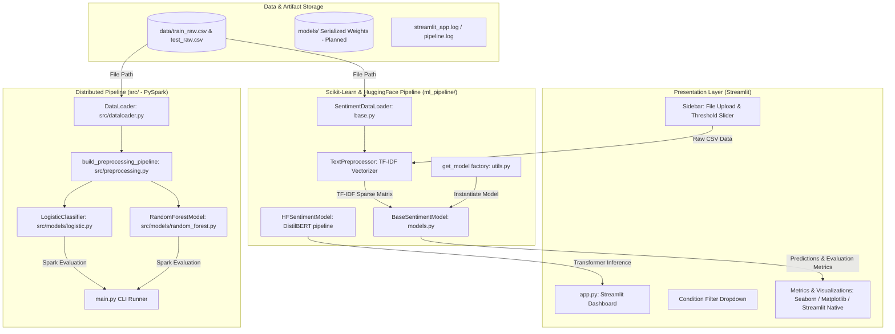

# Project Details: Sentimental Analysis on Drug Reviews using NLP

---

## 2.1 Project Overview

* **Project Name:** Sentimental-Analysis-on-Drug-Reviews-using-NLP
* **One-Line Description:** An end-to-end NLP and machine learning platform to analyze patient sentiment, extract drug experience insights, and evaluate treatment feedback from real-world drug reviews.
* **Purpose of the Project:** The project bridges the gap between patient feedback and clinical understanding. It processes unstructured drug reviews to identify whether a patient's sentiment toward a medication is positive, negative, or neutral, while exploring correlations between patient ratings, conditions, and reported experiences.
* **Problem It Solves:** Online health forums and opinion boards contain tens of thousands of candid patient reviews. However, manually reading and categorizing this massive volume of unstructured text is impractical for doctors, pharmacovigilance teams, and pharmaceutical researchers. This project automates the classification of review sentiment, measures model performance across traditional and deep learning algorithms, and highlights trends across medical conditions and individual drugs.
* **Why the Project Exists:** Drug efficacy and adverse reactions are often buried within narrative reviews. By turning unstructured text into structured sentiment metrics, the platform helps identify drug satisfaction patterns, track negative experiences, and assist healthcare stakeholders in understanding patient reception.
* **Target Users:**
  1. *Pharmaceutical Researchers & Pharmacovigilance Analysts:* To monitor drug sentiment trends, identify recurring negative reviews, and track patient-reported side effects.
  2. *Healthcare Professionals & Clinicians:* To understand real-world patient satisfaction for specific conditions beyond clinical trials.
  3. *Patients & Consumers:* To gain high-level insights into patient experiences across alternative medications for their condition.
  4. *Data Science & ML Practitioners:* To benchmark classical machine learning, distributed Spark ML, and transformer-based architectures on medical domain text.
* **Current Development Status:** Active Prototype / Research Baseline. The repository contains working Scikit-Learn pipelines, an initial Streamlit dashboard, a PySpark pipeline for distributed processing, and exploratory notebooks. It is currently being upgraded into an interactive, multi-class, production-ready system.

---

## 2.2 Project Explained in Simple Language

### How It Works for a Beginner
Imagine you have a condition (like asthma or migraine) and doctors prescribe a drug. After taking it, patients write reviews online describing how it helped them, whether they experienced dizziness, nausea, or quick relief, and they give it a rating out of 10.

Reading 100,000 reviews by hand is impossible. This software takes all those reviews, reads them using Natural Language Processing (teaching computers to understand human language), and automatically determines:
* Is this patient happy with the medication (Positive)?
* Did the patient experience a bad reaction or ineffective treatment (Negative)?
* Which drug has the highest satisfaction for a given medical condition?

### Simple Workflow Diagram

```text
       User (Doctor / Analyst / Patient)
                       │
                       ▼
           Upload Data or Input Review
                       │
                       ▼
            Streamlit Web Application
                       │
                       ▼
       Text Cleaning & Feature Extraction
          (Stopwords removed, TF-IDF / Vectors)
                       │
                       ▼
         Machine Learning / NLP Models
     (Logistic Regression, GBT, DistilBERT, etc.)
                       │
                       ▼
     Sentiment Classification & Metrics Calculated
   (Accuracy, ROC-AUC, F1-Score, Confusion Matrix)
                       │
                       ▼
       Interactive Dashboard & CSV Export
                       │
                       ▼
             User Receives Insights
```

1. **User Action:** The user opens the web application and uploads patient review files (or filters by medical condition).
2. **System Action:** The system cleans the review text (stripping noise and symbols), converts words into numbers using TF-IDF (Term Frequency-Inverse Document Frequency), and feeds them into machine learning classifiers.
3. **Processing:** Multiple models (such as Logistic Regression, Gradient Boosting, Random Forest, Naive Bayes, Support Vector Machines, and DistilBERT) evaluate the text.
4. **Result:** The user sees a comparison table of model scores, charts showing positive vs. negative sentiment distribution, top drugs for the selected condition, satisfaction trends over time, and can download the predictions.

---

## 2.3 Technical Architecture

The codebase contains two architectural workflows:
1. **Interactive Scikit-Learn & Streamlit Pipeline (`ml_pipeline/` + `app.py`):** Designed for real-time visualization, single-machine model comparison, and interactive evaluation.
2. **Distributed Big Data Pipeline (`src/` + `main.py`):** Designed for scalable, distributed batch processing using Apache Spark (PySpark MLlib).



### Component Breakdown

#### 1. Presentation Layer (`app.py`)
* **Simple Explanation:** The graphical user interface where users upload data, adjust settings, and view graphs.
* **Technical Explanation:** Built with Streamlit (`st.set_page_config`, `st.sidebar`, `st.columns`, `st.metric`). Accepts training and test CSV files via `st.file_uploader`. Provides condition filtering via `st.sidebar.selectbox` and decision threshold tuning via `st.slider`. Renders model comparison tables, confusion matrix heatmaps (Seaborn/Matplotlib), sentiment trends over time, and a CSV download button for generated predictions.

#### 2. Feature Extraction & Classical ML Pipeline (`ml_pipeline/`)
* **Simple Explanation:** The engine that reads the text, turns words into numbers, trains algorithms, and tests how accurate they are.
* **Technical Explanation:**
  * [ml_pipeline/base.py](file:///d:/Sentimental-Analysis-on-Drug-Reviews-using-NLP/ml_pipeline/base.py): Implements `SentimentDataLoader` (loads CSV, binarizes ratings where `rating > 5` is positive `1`, else `0`) and `TextPreprocessor` (uses Scikit-Learn `TfidfVectorizer(max_features=10000, stop_words='english')` fitted on combined train and test texts).
  * [ml_pipeline/models.py](file:///d:/Sentimental-Analysis-on-Drug-Reviews-using-NLP/ml_pipeline/models.py): Implements `BaseSentimentModel` wrapping Scikit-Learn estimators with standardized `train()`, `evaluate()`, `save()`, and `load()` methods using `joblib`.
  * [ml_pipeline/utils.py](file:///d:/Sentimental-Analysis-on-Drug-Reviews-using-NLP/ml_pipeline/utils.py): Factory function `get_model(model_name)` supporting `"gbt"`, `"logistic"`, `"naive_bayes"`, `"random_forest"`, and `"svm"`. Also configures system logging via `setup_logging()`.

#### 3. Transformer Pipeline (`ml_pipeline/hf_sentiment.py`)
* **Simple Explanation:** A modern deep learning language model that understands the meaning and tone of sentences.
* **Technical Explanation:** Uses Hugging Face `transformers.pipeline("text-classification", model="distilbert-base-uncased-finetuned-sst-2-english")`. Iterates through test review strings and maps predicted labels (`POSITIVE` $\rightarrow 1$, `NEGATIVE` $\rightarrow 0$).

#### 4. Distributed Processing Engine (`src/` & `main.py`)
* **Simple Explanation:** A high-speed system for processing huge datasets across multiple computer processors using Apache Spark.
* **Technical Explanation:**
  * [src/dataloader.py](file:///d:/Sentimental-Analysis-on-Drug-Reviews-using-NLP/src/dataloader.py): Implements `DataLoader(spark: SparkSession)` that cleans carriage-return column headers, casts `usefulCount`, joins train and test splits, and constructs sentiment and string length columns.
  * [src/preprocessing.py](file:///d:/Sentimental-Analysis-on-Drug-Reviews-using-NLP/src/preprocessing.py): Builds a Spark ML `Pipeline` comprising `Tokenizer`, `StopWordsRemover`, `CountVectorizer`, `IDF`, `StringIndexer`, and `VectorAssembler`.
  * [src/models/logistic.py](file:///d:/Sentimental-Analysis-on-Drug-Reviews-using-NLP/src/models/logistic.py) & [src/models/random_forest.py](file:///d:/Sentimental-Analysis-on-Drug-Reviews-using-NLP/src/models/random_forest.py): Wrappers around Spark MLlib classifiers with `BinaryClassificationEvaluator` calculating ROC-AUC.

---

## 2.4 Technology Stack

| Layer | Technology | Purpose in This Project |
| :--- | :--- | :--- |
| **Frontend / UI** | Streamlit (v1.x) | Web-based interactive dashboard for file uploads, model comparisons, and interactive visualizations. |
| **Frontend Plotting** | Matplotlib & Seaborn | Generating confusion matrix heatmaps and custom evaluation plots. |
| **Backend Runtime** | Python (3.10 – 3.12) | Core programming language for all pipelines, CLI tools, and web services. |
| **Classical ML** | Scikit-Learn (`scikit-learn`) | TF-IDF vectorization, Logistic Regression, Naive Bayes, Random Forest, GBT, SVM, and evaluation metrics. |
| **Transformers / Deep Learning** | Hugging Face `transformers`, `torch` | Pre-trained DistilBERT transformer pipeline for deep NLP sentiment inference. |
| **Big Data / Distributed ML** | Apache Spark / PySpark MLlib | Distributed data loading, tokenization, count vectorization, IDF, and Spark ML classifiers. |
| **Data Manipulation** | Pandas & NumPy | In-memory dataframes, array math, sample weight calculations, and time-series aggregations. |
| **Text Utilities** | NLTK & BeautifulSoup4 | Text cleaning, tokenization, lemmatization, and stripping HTML entities from raw review text. |
| **Model Persistence** | Joblib | Serializing trained Scikit-Learn models and vectorizers to disk. |
| **Logging** | Python standard `logging` | Structured execution logging to console and persistent log files (`streamlit_app.log`, `pipeline.log`). |
| **Testing** | Pytest & Unittest | Unit test execution for data loaders and pipeline components. |
| **Database** | *Not currently available — confirmation required.* | No SQL/NoSQL database engine is implemented. Data is loaded directly from CSV files. |
| **Authentication** | *Not currently available — confirmation required.* | The system does not currently feature user accounts, login mechanisms, or role-based access control. |
| **API Endpoints** | *Not currently available — confirmation required.* | No REST (FastAPI/Flask) or gRPC endpoints exist in the repository; communication is currently in-process. |

---

## 2.5 Dataset / Data

### Data Source & Context
The project is built around the **Drug Review Dataset** (originally sourced from the UCI Machine Learning Repository and Kaggle, collected from sites like Drugs.com).

* **Location in Project:** Expected inside `data/` directory (e.g., `data/train_raw.csv` and `data/test_raw.csv`, or `data/train/drugsComTrain_raw.csv` and `data/test/drugsComTest_raw.csv` as referenced in [config.py](file:///d:/Sentimental-Analysis-on-Drug-Reviews-using-NLP/config.py)). *Note: Raw CSV files are excluded from version control via `.gitignore`.*
* **Format:** Comma-Separated Values (CSV) with double-quoted, multiline text fields.
* **Approximate Size:** ~215,000 total reviews (~161,297 train reviews, ~53,766 test reviews, ~100MB+ uncompressed).

### Important Fields & Data Dictionary

| Field Name | Data Type | Description & Meaning |
| :--- | :--- | :--- |
| `uniqueID` | Integer / String | Unique identifier assigned to each individual review entry. |
| `drugName` | String | Commercial or generic brand name of the drug (e.g., *Sertraline*, *Liraglutide*, *Mirena*). |
| `condition` | String | Medical condition or indication the drug was prescribed for (e.g., *Depression*, *Type 2 Diabetes*). |
| `review` | String | Patient narrative review describing symptoms, side effects, dosage, and overall experience. |
| `rating` | Float / Integer | Patient satisfaction score on a 10-point scale (1.0 = lowest, 10.0 = highest). |
| `date` | Date / String | Date the review was submitted (formatted as `DD-Mon-YY` or `Month Day, Year`). |
| `usefulCount` | Integer | Number of community users who voted the review as "useful". |

### Data Flow & Preprocessing

```text
Raw CSV File
    │
    ▼
Missing Value Imputation: df['review'].fillna('')
    │
    ▼
HTML Tag Stripping & Encoding Cleanup (BeautifulSoup / Regex)
    │
    ▼
Label Engineering:
    Binary: sentiment = 1 if rating > 5 else 0
    │
    ▼
Feature Extraction:
    TF-IDF Vectorizer (max_features=10000, English stopwords removed)
    │
    ▼
Train / Test Matrices (X_train, X_test, y_train, y_test)
```

1. **Missing Data Handling:** Reviews with null text are replaced with empty strings. Conditions with missing values are dropped during condition-filtered views.
2. **Sentiment Binarization:** Ratings $1.0 - 5.0$ are labeled as `0` (Negative/Neutral), and ratings $6.0 - 10.0$ are labeled as `1` (Positive).
3. **HTML Artifacts:** Many raw reviews contain HTML character escapes (e.g., `&#039;` for apostrophes, `&amp;` for ampersands). The legacy EDA scripts employ `BeautifulSoup` to unescape these entities.
4. **Data Limitations:**
   * **Bimodal Rating Distribution:** Reviews are heavily skewed toward extreme ratings ($10$ and $1$), with fewer moderate ratings ($4 - 7$).
   * **Condition Noise:** The `condition` column contains entries like `"</span> users found this comment helpful."` which represent scraping artifacts that need filtering.
   * **Aspect Conflation:** A review may report that a drug cured the condition (high efficacy) but caused severe nausea (adverse event). Collapsing the review into a single binary label loses these vital clinical nuances.

---

## 2.6 Application Workflow

### Complete End-to-End Execution Flow (Streamlit)

```text
1. User Launches Dashboard:
   streamlit run app.py
       │
2. Sidebar Interaction:
   User uploads training CSV and testing CSV
       │
3. Optional Filter:
   User chooses specific condition (e.g., "Depression") or keeps "All"
       │
4. Preprocessing:
   TextPreprocessor fits TF-IDF on combined train+test text
   Target labels generated from rating (> 5 -> 1, <= 5 -> 0)
       │
5. Model Training & Evaluation Loop:
   Loop across models: ["gbt", "logistic", "naive_bayes", "random_forest", "svm", "hf_transformer"]
   - Classical models: fit(X_train, y_train), evaluate(X_test, y_test, threshold)
   - Transformer: pipeline predicts class on df_test['review']
       │
6. Metric Aggregation:
   Calculates Accuracy, ROC-AUC, F1-Score for each model
   Identifies best performing model by highest F1-score
       │
7. Visualization Rendering:
   - Summary Leaderboard Table
   - Class Distribution Bar Chart
   - Top Drugs by Review Count
   - Confusion Matrix Heatmap
   - Time-series Sentiment Trend
   - Top 10 Drugs by Average Rating
       │
8. Export & Logs:
   User clicks "Download Predictions" to save predictions.csv
   User expands "Show Pipeline Logs" to view streamlit_app.log
```

---

## 2.7 Repository & Folder Structure

```text
Sentimental-Analysis-on-Drug-Reviews-using-NLP/
│
├── app.py                             # Streamlit interactive web dashboard
├── config.py                          # Global configuration (paths, max_features, seed)
├── main.py                            # PySpark CLI pipeline entry point
├── run_experiment.py                  # Scikit-Learn CLI pipeline execution script
├── requirements.txt                   # Project Python dependency definitions
├── README.md                          # High-level project summary and usage instructions
├── Spark_fit.PNG                      # Documentation diagram: Spark fit pipeline
├── Spark_Transform.PNG                # Documentation diagram: Spark transform pipeline
│
├── data/                              # Dataset root directory
│   └── README.md                      # Instructions on downloading and placing raw CSVs
│
├── ml_pipeline/                       # Scikit-Learn & HuggingFace modular pipeline
│   ├── __init__.py                    # Module indicator
│   ├── base.py                        # SentimentDataLoader & TextPreprocessor (TF-IDF)
│   ├── models.py                      # BaseSentimentModel wrapper with train/eval/save/load
│   ├── utils.py                       # Model factory (get_model) and logging setup
│   └── hf_sentiment.py                # Hugging Face DistilBERT sentiment pipeline
│
├── src/                               # Distributed PySpark MLlib source code
│   ├── dataloader.py                  # PySpark DataFrame loader & schema cleaner
│   ├── preprocessing.py               # PySpark ML Pipeline (Tokenizer, StopWords, IDF)
│   └── models/                        # PySpark MLlib model wrappers
│       ├── __init__.py                # Module indicator
│       ├── logistic.py                # PySpark LogisticRegression wrapper
│       └── random_forest.py           # PySpark RandomForestClassifier wrapper
│
├── notebooks/                         # Jupyter exploration and prototype notebooks
│   ├── Capstone_EDA.ipynb             # Exploratory Data Analysis & statistical tests
│   ├── Capstone_LogisticRegression.ipynb
│   ├── Capstone_NaiveBayes.ipynb
│   ├── Capstone_RandomForest.ipynb
│   ├── Capstone_DecisionTreeClassifier.ipynb
│   ├── Capstone_GBT.ipynb
│   ├── Capstone_SVM.ipynb
│   └── Capstone_LSTM.ipynb            # Deep learning prototype with Keras/LSTM
│
├── tests/                             # Automated testing suite
│   └── test_base.py                   # Unittest for SentimentDataLoader
│
├── docs/                              # Project documentation
│   ├── project_details.md             # Complete technical specification and guide
│   ├── feature_enhancement.md         # 1.5-week feature roadmap and backlog
│   └── dev/
│       └── dev_plan.md                # Day-by-day developer execution plan
│
└── Capstone_*.py                      # Legacy monolithic experimental scripts (EDA, LSTM, etc.)
```

---

## 2.8 APIs

* **Current Status:** `Not currently available — confirmation required.`
* **Details:** The current repository does not implement HTTP REST endpoints (e.g., FastAPI, Flask, or Django REST Framework). All model training, prediction, and visual reporting take place inside the Streamlit runtime or via command-line interface scripts (`main.py`, `run_experiment.py`).
* **Future Backlog (Post-Sprint):**
  * Standalone REST API endpoints (`/predict`, `/health`) are deferred to post-sprint milestones to maintain focus on core model stabilization and testing.

---

## 2.9 Database

* **Current Status:** `Not currently available — confirmation required.`
* **Details:** There is no relational database (PostgreSQL, MySQL, SQLite) or NoSQL database (MongoDB, Redis) integrated into the project. All operations run directly against flat CSV files (`drugsComTrain_raw.csv` and `drugsComTest_raw.csv`).
* **Future Backlog (Post-Sprint):** For production workloads, processed reviews, drug sentiment aggregates, and metrics may be loaded into an SQLite or PostgreSQL database in future phases.

---

## 2.10 AI / ML / Business Logic

### 1. Sentiment Labeling Logic
The project converts a continuous rating scale ($1 - 10$) into a binary classification task:
$$\text{Sentiment} = \begin{cases} 1 \text{ (Positive)}, & \text{if } \text{Rating} > 5 \\ 0 \text{ (Negative/Neutral)}, & \text{if } \text{Rating} \le 5 \end{cases}$$

### 2. Feature Extraction Pipeline
* **Text Normalization:** Lowercased text with standard English stop words removed (`sklearn.feature_extraction.text.TfidfVectorizer`).
* **Vocabulary Sizing:** Configured to retain the top $10,000$ unigrams/bigrams ordered by term frequency across the corpus (`max_features=10000`).

### 3. Machine Learning Algorithms Implemented
* **Logistic Regression:** Linear classifier with L2 regularization (`max_iter=1000`). Serves as the primary high-speed baseline.
* **Multinomial Naive Bayes:** Probabilistic classifier modeling word frequency occurrences (`MultinomialNB`).
* **Random Forest Classifier:** Ensemble of 100 decision trees (`n_estimators=100, random_state=42`) evaluating nonlinear word combinations.
* **Gradient Boosting Trees (GBT):** Sequentially boosted decision trees with custom inverse class weighting to address imbalance between positive and negative reviews:
  $$w_c = \frac{N}{2 \times N_c}$$
* **Support Vector Classifier (SVC):** Kernel-based margin classifier with probability calibration (`probability=True`).
* **DistilBERT Transformer:** Pre-trained 66-million parameter model (`distilbert-base-uncased-finetuned-sst-2-english`) performing tokenized contextual attention.

### 4. Decision Threshold Tuning
In `app.py`, predictions for probabilistic models are governed by a configurable decision threshold:
$$\hat{y} = \begin{cases} 1, & P(\text{Positive} \mid X) \ge \tau \\ 0, & P(\text{Positive} \mid X) < \tau \end{cases}$$
where $\tau \in [0.0, 1.0]$ is dynamically adjusted by the user in the sidebar (default $\tau = 0.50$).

---

## 2.11 Configuration

Global parameters are defined in [config.py](file:///d:/Sentimental-Analysis-on-Drug-Reviews-using-NLP/config.py):

```python
# config.py
DATA_TRAIN_PATH = "data/train/drugsComTrain_raw.csv"
DATA_TEST_PATH = "data/test/drugsComTest_raw.csv"
MODEL_SAVE_PATH = "models/"
TFIDF_MAX_FEATURES = 10000
RANDOM_STATE = 42
```

* **Environment Variables:** No external API keys or environment secrets are currently required.
* **Logging Configuration:** Centralized in `ml_pipeline/utils.py` using standard formatting: `"%(asctime)s [%(levelname)s] %(message)s"`, streaming to both `sys.stdout` and a log file (`pipeline.log` or `streamlit_app.log`).

---

## 2.12 Installation & Setup

### Prerequisites
* Python 3.10, 3.11, or 3.12 installed on Windows, macOS, or Linux.
* Git installed.
* Optional (for PySpark pipeline only): Java 8 or 11 runtime environment (`JAVA_HOME` configured).

### Step-by-Step Instructions

#### 1. Clone the Repository
```bash
git clone https://github.com/jimaaa17/Sentimental-Analysis-on-Drug-Reviews-using-NLP.git
cd Sentimental-Analysis-on-Drug-Reviews-using-NLP
```

#### 2. Create and Activate Virtual Environment
```bash
# Windows (PowerShell)
python -m venv venv
.\venv\Scripts\Activate.ps1

# Linux / macOS
python3 -m venv venv
source venv/bin/activate
```

#### 3. Install Dependencies
```bash
pip install --upgrade pip
pip install -r requirements.txt
```

#### 4. Prepare the Dataset
1. Download the Drug Review Dataset from [Kaggle](https://www.kaggle.com/datasets/jessicali9530/kaggles-drug-review-dataset) or the UCI ML repository.
2. Place the uncompressed CSV files inside `data/`:
   * `data/train_raw.csv` (or `data/train/drugsComTrain_raw.csv`)
   * `data/test_raw.csv` (or `data/test/drugsComTest_raw.csv`)

#### 5. Launch the Streamlit Dashboard
```bash
streamlit run app.py
```
Open your browser at `http://localhost:8501`. Use the sidebar to upload your training and testing CSV files.

#### 6. Run the CLI Experiment Pipeline (Scikit-Learn)
```bash
python run_experiment.py --train data/train_raw.csv --test data/test_raw.csv --model logistic
```
Supported `--model` options: `gbt`, `logistic`, `naive_bayes`, `random_forest`, `svm`.

#### 7. Run Distributed Pipeline (PySpark - Optional)
```bash
python main.py --train data/train_raw.csv --test data/test_raw.csv --model logistic
```

#### 8. Run Unit Tests
```bash
pytest -v
# Or using standard unittest:
python -m unittest discover -s tests
```

---

## 2.13 Common Developer Tasks

### 1. Adding a New Machine Learning Classifier
1. Open [ml_pipeline/utils.py](file:///d:/Sentimental-Analysis-on-Drug-Reviews-using-NLP/ml_pipeline/utils.py).
2. Import the estimator inside `get_model()`.
3. Add a new branch:
   ```python
   elif model_name == "extra_trees":
       from sklearn.ensemble import ExtraTreesClassifier
       return ExtraTreesClassifier(n_estimators=100, random_state=42)
   ```
4. Add `"extra_trees"` to `model_names` in [app.py](file:///d:/Sentimental-Analysis-on-Drug-Reviews-using-NLP/app.py) and choices in [run_experiment.py](file:///d:/Sentimental-Analysis-on-Drug-Reviews-using-NLP/run_experiment.py).

### 2. Modifying Text Preprocessing
1. Open [ml_pipeline/base.py](file:///d:/Sentimental-Analysis-on-Drug-Reviews-using-NLP/ml_pipeline/base.py).
2. Edit `TextPreprocessor`: adjust `ngram_range=(1, 2)`, modify `min_df`, or introduce custom regex/lemmatization in the tokenizer callable.

### 3. Adding New Dashboard Visualizations
1. Open [app.py](file:///d:/Sentimental-Analysis-on-Drug-Reviews-using-NLP/app.py).
2. Insert new Streamlit widgets or Matplotlib charts inside the `# --- Insights Section ---`.

### 4. Running and Writing Tests
1. Test files reside in `tests/` prefixed with `test_`.
2. Add new test cases subclassing `unittest.TestCase` or using standard Pytest fixtures.
3. Execute `pytest -q tests/` to confirm assertions.

---

## 2.14 Known Issues & Technical Limitations

1. **On-the-Fly Model Training in UI:** In [app.py](file:///d:/Sentimental-Analysis-on-Drug-Reviews-using-NLP/app.py), all classical models are fitted synchronously inside the Streamlit script execution whenever a dataset is uploaded or a filter is changed. On full datasets (~160,000 rows), this causes severe latency and memory exhaustion.
2. **Missing Pre-trained Serialized Models:** Models are not saved or loaded from `.joblib` files by default; they are retrained repeatedly.
3. **Binary Sentiment Oversimplification:** Real-world patient feedback includes neutral experiences (ratings 4–6). Forcing a binary boundary at rating 5 distorts nuanced reviews and treats mild dissatisfaction identically to dangerous adverse events.
4. **General Domain Transformer:** The current Hugging Face pipeline in [ml_pipeline/hf_sentiment.py](file:///d:/Sentimental-Analysis-on-Drug-Reviews-using-NLP/ml_pipeline/hf_sentiment.py) uses `distilbert-base-uncased-finetuned-sst-2-english` (trained on Rotten Tomatoes movie reviews). It lacks medical vocabulary and misunderstands clinical terminology.
5. **No Single Review Inference in UI:** Users cannot type or paste a single review into the dashboard to test predictions in real-time; the UI only accepts CSV uploads.
6. **Hardcoded Paths in Legacy Files:** Several root `Capstone_*.py` files and notebooks contain hardcoded developer paths (e.g., `C:/MITA Spring 19/Turkoz/Capstone/...`) and will crash unless edited.
7. **PySpark Setup Dependency:** `src/` requires an operational Apache Spark installation and Java runtime, which creates friction for developers running lightweight Python virtual environments.
8. **Unit Tests Require Kaggle CSV:** [tests/test_base.py](file:///d:/Sentimental-Analysis-on-Drug-Reviews-using-NLP/tests/test_base.py) attempts to read `data/train/train_raw.csv` directly and fails if the Kaggle files are not placed beforehand.
